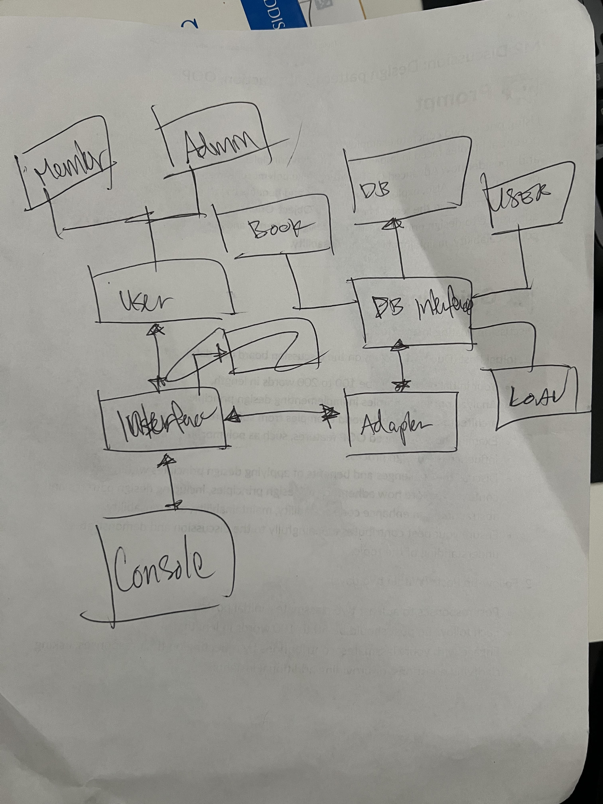
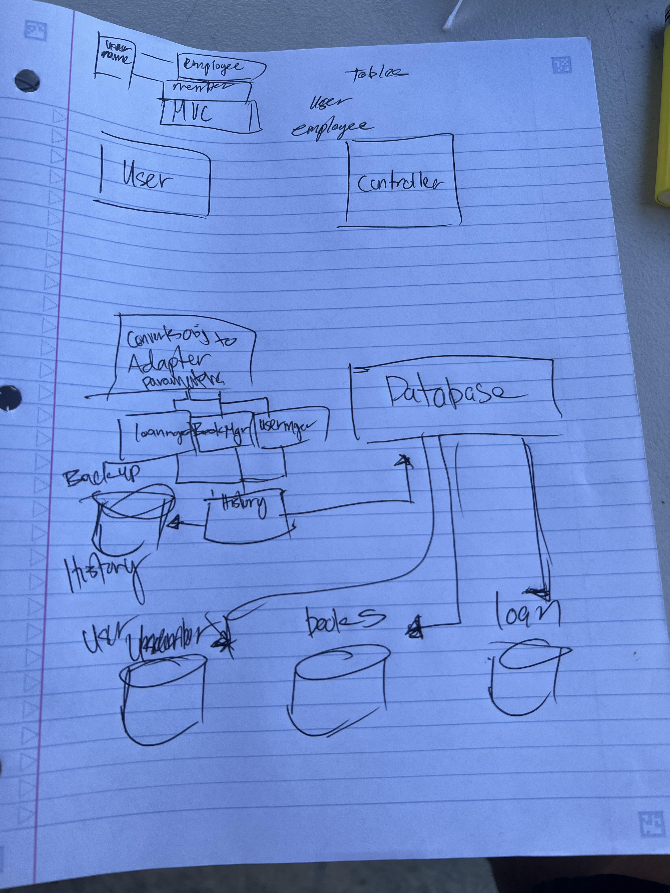
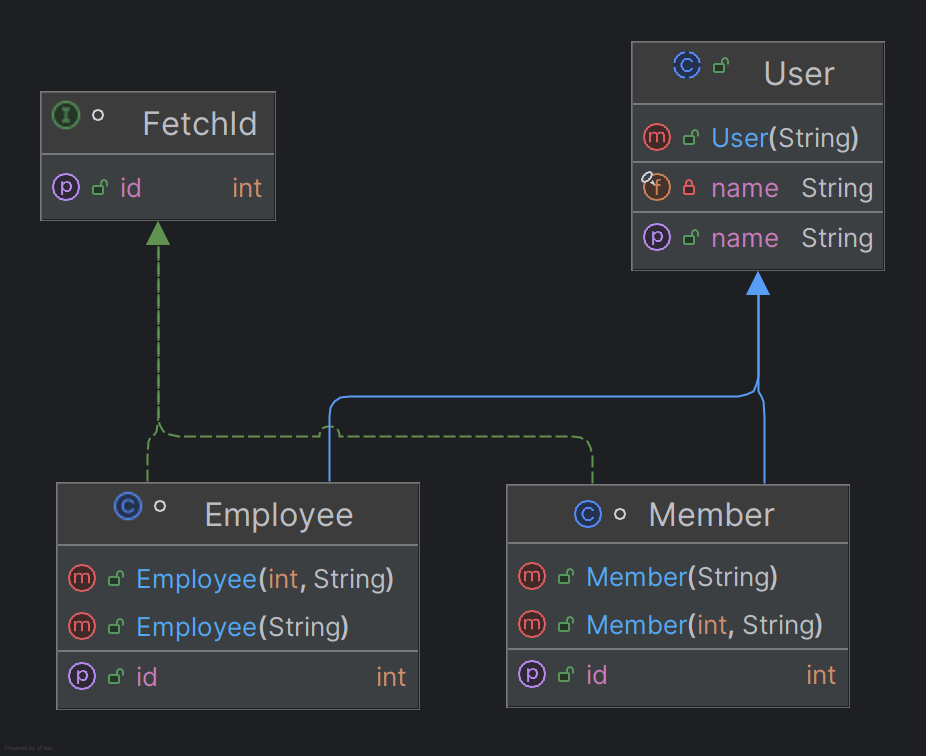
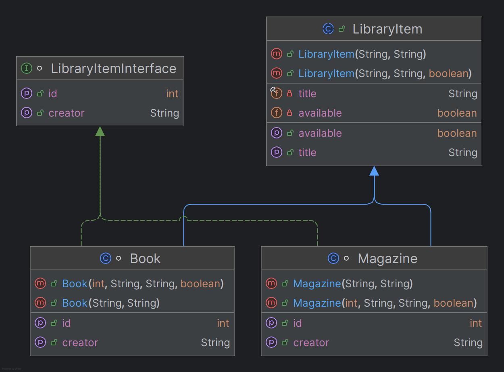
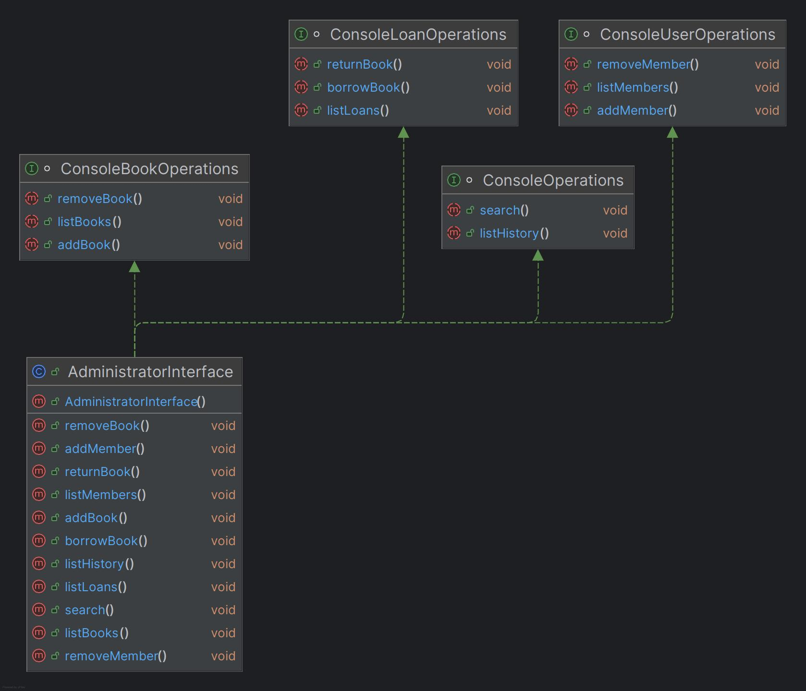
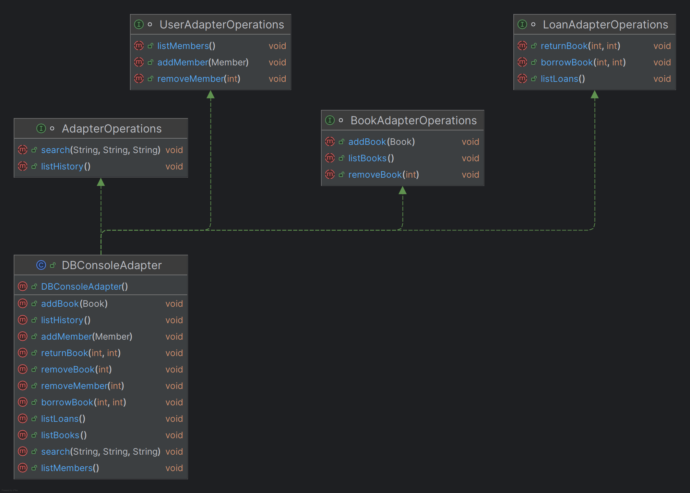
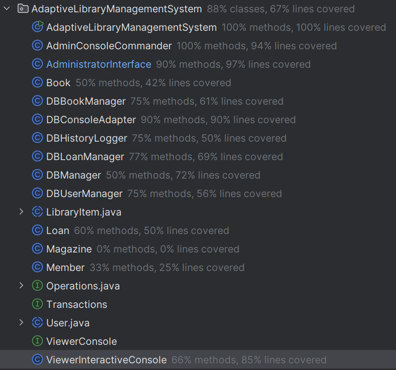
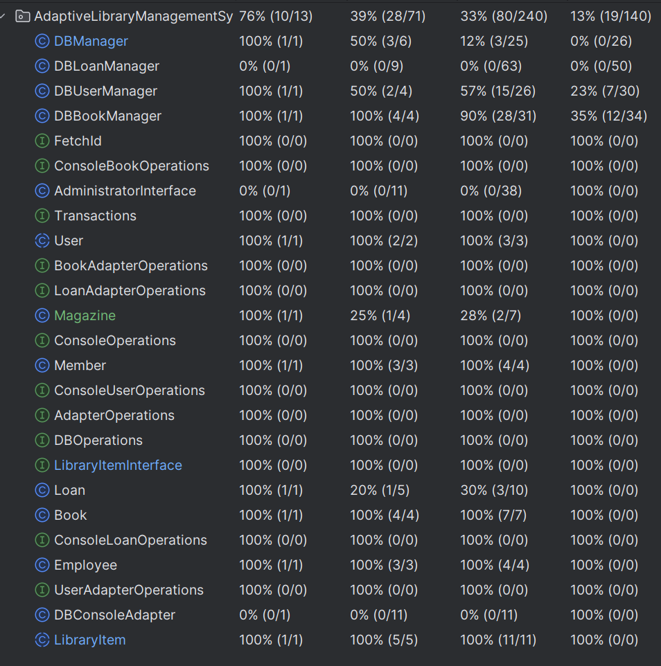

# [Adaptive Library Management System]
## Dr. Magda Tsintsadze
### Quy Nguyen - Dhruv Shah
### SDSU Global: CS635 FALL 2024
### Sept. 29, 2024

#### **Design Documentation**
Originally we thought the project was going to be a simple Adaptive Library Management System. Our design is modeled
as close as we could to the MVC design which incorporates several design patterns in itself. This made the most sense
because we had a user console that is our viewer or presentation to the user, a controller that would respond to user
inputs, and the model our application object (the class models and interactions with the library database). 

Class and interface relationships.
We wanted to be able to have a Transactions interface that would be implemented by the User, LibraryItem, and Loan classes
because they all share the same behavior of adding, removing, and searching requests to database.

Interfaces:
Our approach for intercommunication between the user and the database would be mediated by a controller. We applied the
command design pattern to the AdministratorInterface. We also wanted to include the Adaptor design pattern to be able
to send User, LibraryItem, or Loan objects directly and have the Adaptor translate it into the data needed for the
database interface.

We decided on using abstract classes for people and library items. This would allow us to show an example of class
hierarchy by being able to create derived classes that inherit attributes from the abstract class. The abstract class
is never instantiated.

<figure>
<figcaption>First Sketch</figcaption>

</figure>

<figure>
<figcaption>Second Rough Sketch</figcaption>

</figure>

<figure>
<figcaption>User Class Diagram</figcaption>

</figure>

Our decision to have a libraryItem as an abstract class as well is because there are many library items in a library
such as books, magazines, journals, film, and the list goes on. They all have one thing in common, and it is an id
associated with the item. From the abstract class we can expand it with subclasses that could have attributes specific
to the item type.

<figure>
<figcaption>LibraryItem Class Diagram</figcaption>

</figure>   

<figure>
<figcaption>AdminInterface</figcaption>

</figure>

<figure>
<figcaption>Console to Database Adapter Interface</figcaption>

</figure>

### Testing Coverage and Results
We were not able to create a comprehensive test plan to get 100 percent code coverage.
A majority of our testing was manual testing, and it seems that the application is working as intended.
We are able to add, remove, and search for members, books, and loans. Data persistence is working
with the database. We are able to add, remove, and search for entries in the database. We hava
a backup database that records all transactions that writes or deletes from the database, however
we don't have a specific implementation to roll back the data. I have a bunch of tests
in the tests section that does a lot, but my IDE helped generate a portion of those tests.

<figure>
<figcaption>Manual Test Results</figcaption>

</figure>

<figure>
<figcaption>Automated Test Results</figcaption>

</figure>
